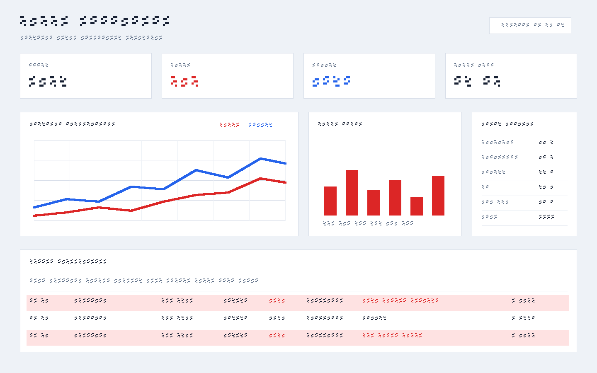

# fraud-detection-rdbms

Production-oriented real-time fraud detection demo with multi-RDBMS adapters, synthetic transaction generation, scikit-learn training, a FastAPI dashboard API, and a React + Vite dashboard.

## Supported Databases

- PostgreSQL
- CockroachDB
- MySQL
- Oracle Free/XE
- SQL Server

Only one database is active at runtime. Select it with `DB_TYPE` in `.env`.

```env
DB_TYPE=postgres
# DB_TYPE=cockroachdb
# DB_TYPE=mysql
# DB_TYPE=oracle
# DB_TYPE=sqlserver
```

## Dashboard Preview



## Run

1. Copy environment defaults:

   ```bash
   cp .env.example .env
   ```

2. Start databases:

   ```bash
   docker compose up -d
   ```

3. Run the schema that matches `DB_TYPE`:

   ```bash
   psql -h localhost -U fraud_user -d fraud_db -f sql/postgres.sql
   ```

   Use `sql/cockroachdb.sql`, `sql/mysql.sql`, `sql/oracle.sql`, or `sql/sqlserver.sql` for other databases.

4. Generate 5000 initial training transactions:

   ```bash
   cd data-loader
   npm install
   node generate_initial_data.js
   ```

5. Train and evaluate the model:

   ```bash
   cd ../ml-service
   pip install -r requirements.txt
   python train_model.py
   ```

6. Start the predictor service:

   ```bash
   python predictor_service.py
   ```

7. Start the FastAPI service:

   ```bash
   uvicorn api_service:app --reload --host 0.0.0.0 --port 8000
   ```

8. Start the dashboard:

   ```bash
   cd ../dashboard
   npm install
   npm run dev
   ```

9. Open the dashboard:

   ```text
   http://localhost:5173
   ```

## Realtime Generator

In another terminal:

```bash
cd data-loader
node realtime_transaction_generator.js
```

It inserts one `PENDING` transaction every second. The predictor service reads up to 1000 pending rows per cycle and updates each row idempotently with `PREDICTED` status.

## Architecture Notes

- Database access uses adapters in `data-loader/db` and `ml-service/db`.
- The dashboard never accesses a database directly; it only calls FastAPI.
- SQL is raw SQL, and database-specific SQL belongs in adapter or schema files.
- `transactions` is the source of truth.
- Model artifact: `ml-service/models/fraud_model.pkl`.
- Metrics artifact: `ml-service/models/model_metrics.json`.

## API Endpoints

- `GET /api/summary`
- `GET /api/latest-transactions`
- `GET /api/fraud-timeseries`
- `GET /api/fraud-types`
- `GET /api/model-metrics`

## Author

**Aria Sukma**

Fraud Detection RDBMS is an open-source real-time fraud detection platform supporting PostgreSQL, CockroachDB, MySQL, Oracle, and SQL Server.

### Maintainer

Aria Sukma

* GitHub: https://github.com/ariasukma/fraud-detection-rdbms/

### License

This project is licensed under the Apache License 2.0.
